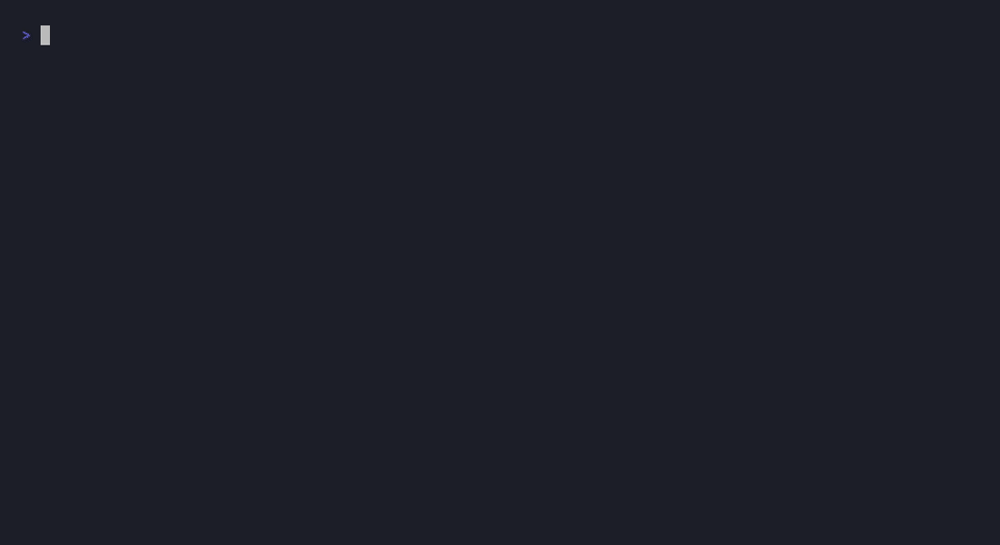

# Demo: `@bolyra/sdk`

A 2-scene runnable demo + a vhs recording script for the v0.3 mutual ZKP
handshake. Output is a clean ~14s GIF you can drop into cold DMs, Discord
posts, or the package README.



## What it shows

1. Human + agent produced two Groth16 proofs bound to a session nonce
2. Verifier runs real `verifyHandshake()` → ✓ VERIFIED (~140ms)
3. Attacker flips one byte of the agent proof → ✗ REJECTED (`PROOF_INVALID`)

Verification is the real production code path (`snarkjs.groth16.verify`
against the same `.vkey.json` the on-chain Solidity verifier was generated
from). Only the *proving* step is pre-recorded — `generate-artifacts.js`
produces `humanProof.json` + `agentProof.json` + `nonce.txt` once, in-repo,
so the runtime demo doesn't need the circuit `.wasm` / `.zkey` (a couple of
hundred MB) or the rapidsnark binary.

## Run it (no recording)

From a clean dir:

```bash
mkdir /tmp/bolyra-sdk-demo && cd /tmp/bolyra-sdk-demo
npm init -y
npm install @bolyra/sdk
BASE=https://raw.githubusercontent.com/bolyra/bolyra/main/sdk/demo
for f in demo.js humanProof.json agentProof.json nonce.txt \
         HumanUniqueness_vkey.json AgentPolicy_groth16_vkey.json; do
  curl -fsSLO "$BASE/$f"
done
node demo.js
```

Or from this repo (uses local `dist/` via the require fallback):

```bash
cd sdk
npm install      # if you haven't already
npm run build    # ensures dist/ exists
node demo/demo.js
```

## Regenerate the proof artifacts

You only need to do this if you change the circuits or bump the SDK in a way
that affects the wire format. From `sdk/` (after `npm run build`):

```bash
node demo/generate-artifacts.js
```

This runs `proveHandshake()` against `circuits/build/` and rewrites
`demo/humanProof.json`, `demo/agentProof.json`, and `demo/nonce.txt`.

## Record the GIF

Requires [vhs](https://github.com/charmbracelet/vhs) and the JetBrains Mono
Nerd Font:

```bash
brew install vhs
brew install --cask font-jetbrains-mono-nerd-font
```

Then:

```bash
mkdir /tmp/bolyra-sdk-demo && cd /tmp/bolyra-sdk-demo
npm init -y && npm install @bolyra/sdk
cp /path/to/bolyra/sdk/demo/{demo.js,demo.tape,humanProof.json,agentProof.json,nonce.txt,HumanUniqueness_vkey.json,AgentPolicy_groth16_vkey.json} .
vhs demo.tape
```

Outputs `demo.gif` in the same dir.

## Notes

- The published `@bolyra/sdk` tarball ships only `dist/` + `src/`. Circuit
  vkeys live in this `demo/` dir so the runtime demo can pass
  `{ circuitDir: __dirname }` to `verifyHandshake()`.
- The "tampered proof" rejection flips one hex character of `pi_a[0]`. Any
  single-bit mutation of a Groth16 proof element invalidates the pairing
  check — the rejection is mathematical, not a string compare.
- `demo.js` is identical from npm-install vs in-repo: it tries
  `require("@bolyra/sdk")` first, falls back to `require("../dist")`.
- The `demo/` directory is excluded from the npm tarball (the package.json
  `files` allowlist only ships `dist/`, `src/`, `LICENSE`, `NOTICE`).
